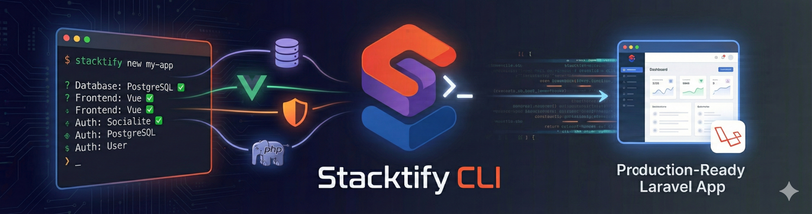

# Stacktify CLI

A command-line tool for scaffolding production-ready Laravel applications with opinionated defaults and best practices.

## Table of Contents

- [Why Stacktify](#why-stacktify)
- [Features](#features)
- [Requirements](#requirements)
- [Installation](#installation)
- [Quick Start](#quick-start)
- [Usage](#usage)
- [Configuration Options](#configuration-options)
- [Command Options](#command-options)
- [Troubleshooting](#troubleshooting)
- [Credits](#credits)
- [License](#license)

## Why Stacktify?

Setting up a production-ready Laravel application involves many repetitive tasks: choosing tools, configuring settings, ensuring consistency across projects, and hardening your application for production environments.

**Stacktify automates this entire process.**

With a single command, you get a clean, well-configured Laravel application built on battle-tested conventions. This saves time, reduces configuration errors, and gives every project a solid foundation from day one.

## Features

- **Production-Ready Configuration**: AppServiceProvider optimizations including immutable dates, strict mode, HTTPS enforcement, and security hardening
- **Code Quality Tools**: Pre-configured Laravel Pint, Rector, and PHPStan for maintaining code standards
- **Security**: Roave Security Advisories integration to prevent vulnerable dependencies
- **Custom Stubs**: Opinionated code generation templates for a consistent project structure
- **Git Integration**: Automatic repository initialization with organized, meaningful commits
- **Flexible Stack Selection**: Choose your frontend framework, authentication method, database, and development tools
- **Smart Defaults**: Sensible configuration choices that work out of the box

## Requirements

- PHP 8.4 or higher
- Composer 2.x or higher

## Installation

Install Stacktify globally via Composer:

```bash
composer global require techieni3/stacktify-cli
```

Ensure your Composer global bin directory is in your system's `PATH`:

```bash
# Check the location
composer global config bin-dir --absolute

# Add to your shell profile if needed
# For Bash: ~/.bashrc or ~/.bash_profile
# For Zsh: ~/.zshrc
export PATH="$HOME/.composer/vendor/bin:$PATH"
```

Verify the installation:

```bash
stacktify --version
```

## Quick Start

Create a new Laravel application with interactive prompts:

```bash
stacktify new my-app
```

Follow the prompts to configure:
1. Application name
2. Frontend stack (Blade, API, Vue, React, Livewire, Filament)
3. Package manager (npm, yarn, pnpm, bun)
4. Authentication method (None, Laravel Auth, Socialite)
5. Database (SQLite, MySQL, MariaDB, PostgreSQL, SQL Server)
6. Testing framework (Pest, PHPUnit)
7. Developer tools (Octane, Telescope, User Permissions, etc.)

## Usage

### Basic Command

```bash
stacktify new <application-name> [options]
```

### Interactive Mode (Default)

```bash
stacktify new my-blog
```

The CLI will prompt you for all configuration choices.

### Non-Interactive Mode

```bash
stacktify new my-api --no-interaction
```

Creates an application using default values:
- Frontend: Blade
- Package Manager: npm
- Authentication: None
- Database: SQLite
- Testing: Pest
- Developer Tools: None

### Development Release

```bash
stacktify new my-app --dev
```

Installs the latest development version of Laravel.

### Force Installation

```bash
stacktify new my-app --force
```

Removes the existing directory and creates a fresh installation.

### Skip Git Initialization

```bash
stacktify new my-app --no-git
```

Creates the application without initializing Git or creating commits.

## Configuration Options

### Frontend Stacks

| Stack | Description | Status |
| :--- | :--- | :--- |
| **Blade** | Laravel's templating engine (default) | ✅ Available |
| **API Only** | Backend API without frontend scaffolding | 🚧 Coming Soon |
| **Vue** | Vue.js with Inertia.js | 🚧 Coming Soon |
| **React** | React with Inertia.js | 🚧 Coming Soon |
| **Livewire** | Laravel Livewire for reactive interfaces | 🚧 Coming Soon |
| **Filament** | Filament admin panel | 🚧 Coming Soon |

### Authentication Methods

| Method | Description | Status |
| :--- | :--- | :--- |
| **None** | No authentication scaffolding (default) | ✅ Available |
| **Laravel Auth** | Built-in Laravel authentication | 🚧 Coming Soon |
| **Laravel Socialite** | OAuth authentication (Google, GitHub, etc.) | 🚧 Coming Soon |

### Database Drivers

| Database | Configuration | Status |
| :--- | :--- | :--- |
| **SQLite** | File-based database (default) | ✅ Available |
| **MySQL** | MySQL 8.0+ | ✅ Available |
| **MariaDB** | MariaDB 10.3+ | ✅ Available |
| **PostgreSQL** | PostgreSQL 12+ | ✅ Available |
| **SQL Server** | Microsoft SQL Server | ✅ Available |

### Testing Frameworks

| Framework | Description | Status |
| :--- | :--- | :--- |
| **Pest** | Modern testing framework (default) | ✅ Available |
| **PHPUnit** | Traditional PHP testing framework | ✅ Available |

### Package Managers

| Manager | Description | Status |
| :--- | :--- | :--- |
| **npm** | Node Package Manager (default) | ✅ Available |
| **yarn** | Fast, reliable package manager | ✅ Available |
| **pnpm** | Efficient disk space usage | ✅ Available |
| **bun** | All-in-one JavaScript runtime | ✅ Available |

### Developer Tools

| Tool | Description | Status |
| :--- | :--- | :--- |
| **Stacktify Recommended** | AppServiceProvider optimizations and config tweaks | ✅ Available |
| **Laravel Octane** | High-performance application server (Swoole/RoadRunner) | ✅ Available |
| **Laravel Telescope** | Debugging and insight tool for development | ✅ Available |
| **Laravel User Permissions** | Role and permission management system | ✅ Available |

## Command Options

| Option | Description |
| :--- | :--- |
| `--dev` | Install the latest development release of Laravel |
| `--no-git` | Skip Git repository initialization and commits |
| `--force`, `-f` | Force installation by removing existing directory |
| `--no-interaction` | Run non-interactively with default values |

## Troubleshooting

### Command Not Found

If you receive a "command not found" error after installation:

1. Verify Composer's global bin directory is in your `PATH`:
   ```bash
   composer global config bin-dir --absolute
   ```

2. Add the directory to your shell profile:
   ```bash
   # For Bash
   echo 'export PATH="$HOME/.composer/vendor/bin:$PATH"' >> ~/.bashrc
   source ~/.bashrc
   
   # For Zsh
   echo 'export PATH="$HOME/.composer/vendor/bin:$PATH"' >> ~/.zshrc
   source ~/.zshrc
   ```

3. Verify the installation:
   ```bash
   stacktify --version
   ```

### Package Installation Failures

If Composer or npm packages fail to install:

1. **Clear Composer cache:**
   ```bash
   composer clear-cache
   ```

2. **Update Composer:**
   ```bash
   composer self-update
   ```

3. **Clear npm cache (if applicable):**
   ```bash
   npm cache clean --force
   ```

## Credits

- Images generated by Gemini and Nono Banana
- Inspired by the Laravel community's best practices

## License

Stacktify CLI is open-sourced software licensed under the [MIT license](LICENSE).

---
**Built with ❤️ for the Laravel community**
